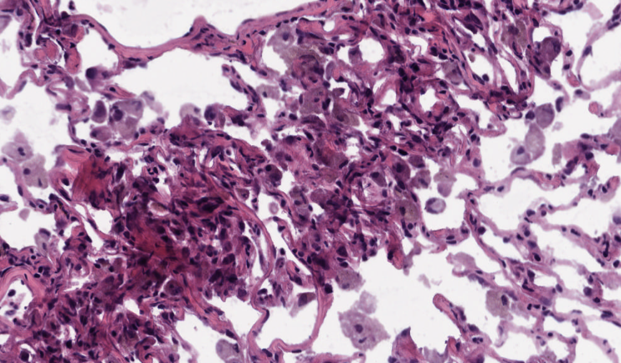
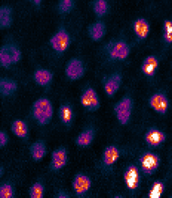
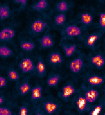
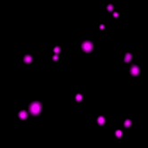
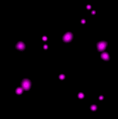
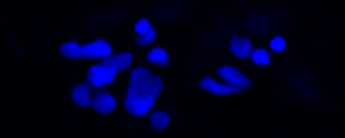

# **c<sup>2</sup>GAN**: Unsupervised content-preserving transformation for optical microscopy.

[](https://ubuntu.com/)
[](https://www.python.org/)
[](https://www.tensorflow.org/)
[](https://opensource.org/licenses/GPL-3.0)
[](https://github.com/Xinyang-Li/c2GAN/graphs/contributors)
[](https://www.biorxiv.org/content/10.1101/848077v2)
[](https://github.com/Xinyang-Li/c2GAN/graphs/commit-activity)
[](https://github.com/Xinyang-Li/c2GAN/issues)
[](https://github.com/Xinyang-Li/c2GAN/graphs/commit-activity)


## Contents


- [Overview](#overview)
- [Repo Structure](#repo-structure)
- [System Environment](#system-environment)
- [Demo](#demo)
- [Results](#results)
- [License](./LICENSE)
- [Issues](https://github.com/Xinyang-Li/c2GAN/issues)
- [Citation](#citation)

# Overview

Our work is based on Cycle-consistent Generative Adversarial Networks (**CycleGANs**) [[paper]](http://openaccess.thecvf.com/content_iccv_2017/html/Zhu_Unpaired_Image-To-Image_Translation_ICCV_2017_paper.html), which makes unsupervised training of CNNs possible and is very illuminating.


To correct mapping biases in scenario of microscopy and provide a robust unsupervised learning method for deep-learning-based computational microscopy, we propose content-preserving CycleGAN (**c<sup>2</sup>GAN**). By imposing additional **saliency constraint**, c<sup>2</sup>GAN can complete pixel-wise regression tasks including image restoration (1-channel to 1-channel),  whole-slide histopathological coloration (1-channel to 3-channel), and virtual fluorescent labeling (13-channel to 3-channel), *etc*. 

Foremost, c<sup>2</sup>GAN needs no pre-aligned training pairs. The laborious work of image acquisition, labeling, and registration can be spared. We release our source code here and hope that our work can be reproducible and offer new possibilities for unsupervised image-to-image transformation in the field of microscopy. For more information and technical support please follow our update.

More details please refer to the companion paper where this method first occurred. [[paper]](https://www.biorxiv.org/content/10.1101/848077v1.abstract)

A readable **python code** of c<sup>2</sup>GAN aiming at realizing unsupervised domain mapping in optical microscopy is provided in this repository. Next, we will guide you step by step to implement our method.

# Repo Structure

```
|---checkpoints
|---|---project_name+time  #creat by code#
|---|---|---meta
|---|---|---index
|---|---|---ckpt
|---data
|---|---training_data
|---|---|---isotrpic  #project_name#
|---|---|---|---trainA
|---|---|---|---trainB
|---|---|---|---testA
|---|---|---|---testB
|---|---fake_image
|---|---|---|---project_name+time
|---|---|---|---fake_x
|---|---|---|---fake_y
|---|---|---|---inferred_image
|---|---|---|---project_name+time
|---|---|---|---inferred_x
|---|---|---|---inferred_y
|---utils
|---|---discriminator.py
|---|---export_graph.py
|---|---generator,py
|---|---inference.py
|---|---model.py
|---|---ops.py
|---|---reader.py
|---|---utils.py
|---preprocess.py
|---main.py
|---README.md
```

# System Environment

* ubuntu 16.04 
* python 3.6.
- **tensorflow-gpu 1.14.0** 
* NVIDIA GPU + CUDA 10.0

## Building environment
We recommend configuring a new environment named *c2gan* on your machine to avoid version conflicts of some packages.The typical install time on a desktop computer with CUDA support is about 10 minutes. We assume that *corresponding NVIDIA GPU support and CUDA 10.0* has been installed on your machine.
* Check your CUDA version
```
$ cat /usr/local/cuda/version.txt
```

* Build anaconda environment

```
$ conda create -n c2gan python=3.6
```

* Activate the *c2gan* environment and install tensorflow

```
$ source activate c2gan
$ conda install tensorflow-gpu=1.14.0
```

* Test if the installation is successful

```
$ python
>>> import tensorflow as tf
>>> tf.__version__
>>> hello = tf.constant("Hello World, TensorFlow!")
>>> sess = tf.Session()
>>> print(sess.run(hello))
```

* Install necessary packages

```
$ conda install -c anaconda scipy
```
# Demo

## Data processing

* You can download some data for demo code from [here](https://github.com/Xinyang-Li/c2GAN/tree/master/data/data_master). 

* Transform your images from '*.tif*' to '*.png*' to use the universal I/O APIs in tensorflow, and then divide the dataset into training set and test set. Usually we use 65%~80% of the dataset as the training data and 20%~35% of the dataset as the test data. Just put images of domain A in the 'trainA' folder, images of domain B in the 'trainB' folder, images of domain A for test in the 'testA' folder,  and images of domain B for results evaluation in the 'testB' folder.

## Training

Encode the training data into tfrecords for fast data loading.

```
$ python preprocess.py --project 1_Isotropic_Liver --type train
```

or

```
$ python preprocess.py --project 1_Isotropic_Liver
```

Start training.

```
$ python main.py
```

You modify the default arguments through command line, for example:

```
$ python main.py  --project 1_Isotropic_Liver  --image_size 128  --channels 1  --GPU 0  --epoch 100000 --type train
```

Here is the list of arguments:

```
--type: 'train or test, default: train'
--project: 'the name of project, default: denoise'
--image_size: 'image size, default: 256'
--batch_size: 'batch size, default: 1'
--load_model: 'folder of saved model, default: None'
--GPU: 'GPU for running code, default: 0'
--channels: 'the channels of input image, default: 3'
--epoch: 'number of training epoch, default: 5'
```

If you interrupt the training process and want to restart training from that point, you can load the former checkpoints like this:

```
$ python main.py  --project 1_Isotropic_Liver  --image_size 128  --channels 1  --GPU 0  --epoch 100000 --type train --load_model 20190922-2222
```

Tensorboard can be used to monitor the training progress and intermediate result.

```
$ tensorboard --logdir 
```

## Test the model

Encode test data into tfrecords

```
$ python3 build_data.py --project 1_Isotropic_Liver --type test
```

We use the same code but different arguments for training and test. You just need to load pre-trained model or checkpoints.

```
$ python main.py --epoch 500 --project 1_Isotropic_Liver --channels 1 --image_size 128 --GPU 0 --type test --load_model 20190926-1619
```

Interpretation of arguments above:

```
--epoch:'the number of images in the testing dataset'
--load_model:'the name of checkpoint folder, you had better name it as "YYYYMMDD-HHMM" '
```

You can obtain the inferenced images at the result folder.

The typical training time on a medium-sized training set is about 10 hours. The performance testing is really fast that it takes less than 50 milliseconds per image.

# Results
Some of our results are exhibited below. For more results and further analyses, please refer to the companion paper where this method first occurred. [[paper]](https://www.biorxiv.org/content/10.1101/848077v1.abstract)
### Unsupervised whole-slide histopathological coloration

|           Input           |           c<sup>2</sup>GAN           |           GT           |
| :-----------------------: | :-----------------------: | :--------------------: |
|  |  |  |
|  |  |  |

### Unsupervised image restoration -- Denoising

|                            Input                             |                            CCGAN                             |                              GT                              |
| :----------------------------------------------------------: | :----------------------------------------------------------: | :----------------------------------------------------------: |
|  |  |  |
|  |  |  |

### Unsupervised image restoration -- Super-resolution (wide-field --> super-resolution)

|                  Input                   |                  c<sup>2</sup>GAN                   |                  GT                   |                  Input                   |                  c<sup>2</sup>CGAN                   |                  GT                   |
| :--------------------------------------: | :--------------------------------------: | :-----------------------------------: | :--------------------------------------: | :--------------------------------------: | :-----------------------------------: |
|  |  |  |  |  |  |
|  |  |  |  |  |  |

### Virtual fluorescent labeling (Phase contrast --> fluorescent imaging)

|                   Input                   |                   c<sup>2</sup>GAN                   |                   GT                   |
| :---------------------------------------: | :---------------------------------------: | :------------------------------------: |
|  |  |  |
|  |  |  |
|  |  |  |

### Pixel-wise classification -- Segmentation

| Input                                    | c<sup>2</sup>GAN                                    | GT                                    |
| ---------------------------------------- | ---------------------------------------- | ------------------------------------- |
|  |  |  |
|  |  |  |


# Problems, issues
You can submit your questions or create an **issue** for any bugs you might encounter [link](https://github.com/Xinyang-Li/c2GAN/issues). We would make response and inspect the code as soon as possible.


# Citation

If you use this code please cite the corresponding paper where original methods appeared: 

["*Unsupervised content-preserving transformation for optical microscopy*".](https://www.biorxiv.org/content/10.1101/848077v1.abstract)

