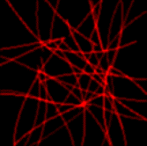
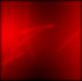
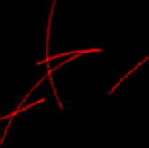
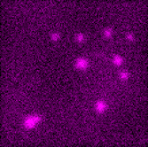
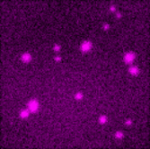
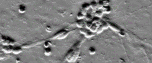
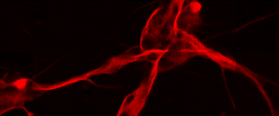
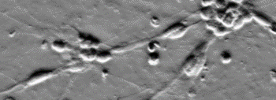

# c<sup>2</sup>GAN: Unsupervised content-preserving transformation for nonlinear pixel-wise regression in microscopy.


Our work is based on Cycle-consistent generative adversarial networks (**CycleGAN**) [[paper]](http://openaccess.thecvf.com/content_iccv_2017/html/Zhu_Unpaired_Image-To-Image_Translation_ICCV_2017_paper.html), which makes unsupervised training of CNNs possible and is very illuminating.

To correct biased mapping in the transformation of micrographs and provide a robost unsupervised learning method for deep-learning-based computational microscopy. We propose  constrained CycleGAN (**c<sup>2</sup>GAN**). By imposing additional **saliency constraint**, c<sup>2</sup>GAN can complete pixel-wise regression tasks including image restoration,  whole-slide histopathological coloration, and virtual cell staining, *etc*. 

Foremost, c<sup>2</sup>GAN needs no pre-aligned training pairs. The laborious work of image acquisition, labeling, and registration can be spared. We release our source code here and hope that our work can be reproducible and offer new possibilities for unsupervised image-to-image transformation in the field of microscopy. For more information and technical support please follow our update.

More details please refer to the published paper. [[paper]](https://www.osapublishing.org/optica/home.cfm)


## c<sup>2</sup>GAN model

A readable python code for c<sup>2</sup>GAN aims at realizing unsupervised domian mapping in optical microscopy.

Next we will mentor you step by step how to implement our computational model.

## Directory structure

The file structure is shown below:

```
|---checkpoints
|---|---project_name+time  #creat by code#
|---|---|---meta
|---|---|---index
|---|---|---ckpt
|---data
|---|---training_data
|---|---|---isotrpic  #project_name#
|---|---|---|---trainA
|---|---|---|---trainB
|---|---|---|---testA
|---|---|---|---testB
|---|---fake_image
|---|---|---|---project_name+time
|---|---|---|---fake_x
|---|---|---|---fake_y
|---|---|---|---inferred_image
|---|---|---|---project_name+time
|---|---|---|---inferred_x
|---|---|---|---inferred_y
|---utils
|---|---discriminator.py
|---|---export_graph.py
|---|---generator,py
|---|---inference.py
|---|---model.py
|---|---ops.py
|---|---reader.py
|---|---utils.py
|---preprocess.py
|---main.py
|---README.md
```

## Environment

* ubuntu 16.04 
* python 3.6.
- **tensorflow-gpu 1.14.0** 
* NVIDIA GPU + CUDA 10.0

## Building environment
We recommend configuring a new environment named *c2gan* on your machine to avoid version conflicts of some packages.We assume that *corresponding NVIDIA GPU support and CUDA 10.0* has been installed on your machine.
* Check your CUDA version
```
$ cat /usr/local/cuda/version.txt
```

* Build anaconda environment

```
$ conda create -n c2gan python=3.6
```

* Activate the *c2gan* environment and install tensorflow

```
$ source activate c2gan
$ conda install tensorflow-gpu=1.10.0
```

* Test if the installation is successful

```
$ python
>>> import tensorflow as tf
>>> tf.__version__
>>> hello = tf.constant("Hello World, TensorFlow!")
>>> sess = tf.Session()
>>> print(sess.run(hello))
```

* Install necessary packages

```
$ conda install -c anaconda scipy
```

## Data processing

* You can download some data for demo code from [here](https://github.com/Xinyang-Li/c2GAN/tree/master/data/data_master). 

* Transform your images from '*.tif*' to '*.png*' to use the I/O APIs in tensorflow, and then divide the dataset into training set and test set. Usually we use 65%~80% of the dataset as the training data and 20%~35% of the dataset as the test data. Just put images of domain A in the 'trainA' folder, images of domain B in the 'trainB' folder, images of domain A for test in the 'testA' folder,  and images of domain B for results evaluation in the 'testB' folder.

## For training

Encode the training data into tfrecords

```
$ python preprocess.py --project 1_Isotropic_Liver --type train
```

or

```
$ python preprocess.py --project 1_Isotropic_Liver
```

Starting trainning

```
$ python main.py
```

If you want to modify the default parameters, you can do this by the command line, for example:

```
$ python main.py  --project 1_Isotropic_Liver  --image_size 128  --channels 1  --GPU 0  --epoch 100000 --type train
```

Here is the list of parameters:

```
--type: 'train or test, default: train'
--project: 'the name of project, default: denoise'
--image_size: 'image size, default: 256'
--batch_size: 'batch size, default: 1'
--load_model: 'folder of saved model, default: None'
--GPU: 'GPU for running code, default: 0'
--channels: 'the channels of input image, default: 3'
--epoch: 'number of training epoch, default: 5'
```

If you interrupted the training process and want to restart training from that point, you can load the former checkpoints like this:

```
$ python main.py  --project 1_Isotropic_Liver  --image_size 128  --channels 1  --GPU 0  --epoch 100000 --type train --load_model 20190922-2222
```

Tensorboard can be used to monitor the training progress and intermediate result.

```
$ tensorboard --logdir 
```

## For testing

Write test data into tfrecords

```
$ python3 build_data.py --project 1_Isotropic_Liver --type test
```

We use the same code but different parameters for training and test. You just need to load your checkpoints like this:

```
$ python main.py --epoch 500 --project 1_Isotropic_Liver --channels 1 --image_size 128 --GPU 0 --type test --load_model 20190926-1619
```

Interpretation of the above parameters:

```
--epoch:'the number of images in the testing dataset'
--load_model:'the name of checkpoint folder, you had better name it as "YYYYMMDD-HHMM" '
```

You can obtain the inferenced images at the result folder.

## Some of our results

### Unsupervised whole-slide histopathological coloration


|           Input           |           c<sup>2</sup>GAN           |           GT           |
| :-----------------------: | :-----------------------: | :--------------------: |
|  |  |  |
|  |  |  |

### Unsupervised image restoration -- Denoising

|                            Input                             |                            CCGAN                             |                              GT                              |
| :----------------------------------------------------------: | :----------------------------------------------------------: | :----------------------------------------------------------: |
|  |  |  |
|  |  |  |

### Unsupervised image restoration -- Super-resolution

|                  Input                   |                  c<sup>2</sup>GAN                   |                  GT                   |                  Input                   |                  c<sup>2</sup>CGAN                   |                  GT                   |
| :--------------------------------------: | :--------------------------------------: | :-----------------------------------: | :--------------------------------------: | :--------------------------------------: | :-----------------------------------: |
|  |  |  |  |  |  |
|  |  |  |  |  |  |

### Virtual fluorescent labeling

|                   Input                   |                   c<sup>2</sup>GAN                   |                   GT                   |
| :---------------------------------------: | :---------------------------------------: | :------------------------------------: |
|  |  |  |
|  |  |  |
|  |  |  |

### Pixel-wise classification -- Segmentation

| Input                                    | c<sup>2</sup>GAN                                    | GT                                    |
| ---------------------------------------- | ---------------------------------------- | ------------------------------------- |
|  |  |  |
|  |  |  |

## Citation and detailed manual

If you use this code please cite the corresponding paper where original methods appeared: 

"*Learning domain mapping between unaligned micrographs using constrained cycle-consistent generative adversarial networks*". [[paper]](https://www.biorxiv.org/content/10.1101/848077v1.abstract)

